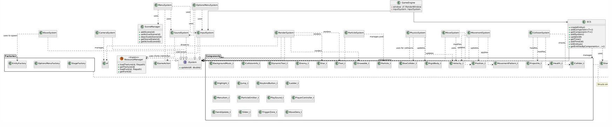
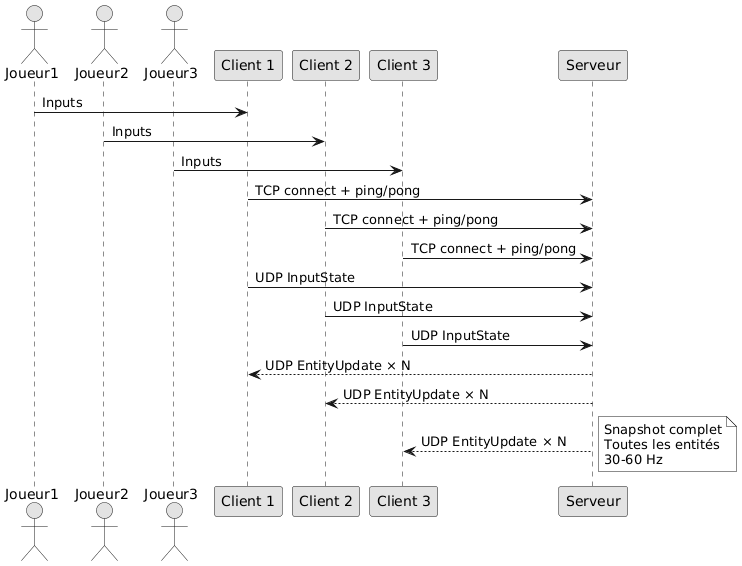

@mainpage R-Type Mirror — Global Technical Documentation

# R-Type Mirror

**R-Type Mirror** is a multiplayer shoot’em up inspired by *R-Type*, developed as an **Epitech 2026** project.
It features a custom **Entity Component System (ECS)** game engine on the client side with advanced systems for physics, particles, menus, and audio, alongside a **UDP** networking architecture for real-time multiplayer gameplay.

This documentation is the **single entry point** for the whole project: game engine, client systems, network module, and protocol specification.

---

## 1. Architectural Decisions (POC)

The project architecture is based on a detailed Proof of Concept (POC) comparing various technologies.
For more details, see the [POC document](poc.md).

### Why SFML?
We selected **SFML (Simple and Fast Multimedia Library)** over alternatives like SDL2, Raylib, or Qt for the following reasons:
*   **Unified Stack:** SFML handles Graphics, Audio, and Networking in a single C++ library, reducing dependencies.
*   **Modern C++:** It supports RAII and C++20 features natively, unlike C-based libraries (SDL2, Raylib).
*   **Architecture Fit:** Its Object-Oriented design aligns perfectly with our ECS architecture.
*   **Protocol Safety:** `sf::Packet` handles Endianness automatically for cross-platform networking.

### ECS vs. OOP
We chose an **Entity Component System (ECS)** over traditional Object-Oriented Programming (OOP) to solve the "Diamond of Death" inheritance problem and improve performance through data locality.
*   **Composition over Inheritance:** Entities are built by composing data components, not by deep inheritance trees.
*   **Performance:** Components are stored in contiguous arrays (`std::vector`), maximizing CPU cache efficiency.

---

## 2. Game Engine (ECS)

The game engine is a custom lightweight ECS implementation, enhanced with advanced features like physics simulation, particle effects, menu systems, and audio management.

### Core Concepts
*   **Entity:** A simple unique ID (`uint32_t`).
*   **Component:** Pure data structs (POD) with no logic (e.g., `Position_t`, `Velocity_t`, `Drawable_t`, `RigidBody_t`).
*   **System:** Pure logic that iterates over entities with specific component signatures (e.g., `PhysicsSystem`, `RenderSystem`).

### Key Characteristics
*   **Max Entities:** 2048
*   **Max Component Types:** 128
*   **Signatures:** `std::bitset` used for $O(1)$ component checks.
*   **Resource Management:** Singleton `ResourceManager` for textures, fonts, and sounds.
*   **Scene Management:** `SceneManager` for handling multiple scenes (e.g., menus, gameplay).
*   **Factories:** Utility classes like `EntityFactory` and `StageFactory` for creating entities and levels.

### Systems Overview
| System | Responsibility |
| :--- | :--- |
| `CameraSystem` | Manages 2D camera with smooth follow, zoom, shake, and bounds. |
| `CollisionSystem` | Handles AABB collisions and resolves entity interactions. |
| `InputSystem` | Captures keyboard/joystick inputs and maps to game actions. |
| `MenuSystem` | Handles menu navigation, item selection, and actions. |
| `MovementSystem` | Applies movement patterns (e.g., sinus, zigzag) to entities. |
| `MoveSystem` | Basic position updates based on velocity, with collision resolution. |
| `OptionsMenuSystem` | Manages sliders, keybinds, and dynamic texts in options menus. |
| `ParticleSystem` | Manages particle pools and emitters for effects like explosions and trails. |
| `PhysicsSystem` | Simulates gravity, forces, jumps, and resolves collisions. |
| `RenderSystem` | Draws sprites, texts, and starfields using SFML. |
| `SoundSystem` | Plays sounds and background music, manages volumes. |
| `WaveSystem` | Spawns enemy waves based on level data. |

---

## 3. Network Architecture

The project uses a **UDP** architecture to balance reliability and latency.

### UDP (Gameplay Channel) - Port 53000
*   **Role:** Real-time high-frequency data transfer.
*   **Functions:** Player inputs (Client -> Server) and Entity snapshots (Server -> Client).
*   **Reliability:** Packet loss is accepted. Newer packets replace older ones (60Hz update rate).

---

## 4. Network Protocol (RFC)

The communication follows a strict protocol defined in [RFC Protocol](rfcprotocol.txt).
### Client -> Server: `InputState`
Sent every frame to update the player's intent.
*   **Size:** 3 Bytes
*   **Structure:** `[PlayerID (1B)] [Input Bitmask (1B)] [Padding/Seq (1B)]`
*   **Inputs:** Up, Down, Left, Right, Shoot.

### Server -> Client: `EntityUpdate`
Broadcasted to all clients to synchronize the game state.
*   **Size:** Packed Struct (~22 Bytes)
*   **Structure:** `[EntityID] [Type] [Position X] [Position Y] [Health] [State]`
*   **Magic Values:** Special IDs are used to denote events (e.g., `0xFFFE` for Entity Death).

### Security & Integrity
*   **Source Validation:** The server validates the sender's IP/Port against the registered Client ID.
*   **Sequence Numbers:** Used to discard out-of-order or replayed packets.
*   **Server Authority:** The server is the single source of truth for positions and collisions; clients only send inputs.

---

## 5. Project Structure

*   `class_graph.png` - Class hierarchy graph.
*   `CMakeLists.txt` - Build configuration.
*   `Doxyfile` - Doxygen configuration.
*   `doxygen-awesome.css` - Custom Doxygen styling.
*   `include/` - Header files.
  *   `engine/` - Game engine components.
    *   `core/` - Core engine files (e.g., `GameEngine.hpp`, `Menu.hpp`).
    *   `ecs/` - ECS core (`ecs.hpp`).
    *   `factory/` - Factories (`EntityFactory.hpp`, `StageFactory.hpp`).
    *   `systems/` - System headers (e.g., `PhysicsSystem.hpp`, `RenderSystem.hpp`).
  *   `server/` - Server-side networking (e.g., `server.hpp`, `UdpServer.hpp`).
*   `mainpage.md` - This documentation entry point.
*   `Makefile` - Build automation.
*   `network_graph.png` - Network architecture graph.
*   `poc.md` - Proof of Concept document.
*   `rfcprotocol.txt` - Network protocol specification.

---

## Authors

**Epitech 2026 – R-Type Mirror**
*   Gabriel Villemonte
*   Clément Chellier
*   Mathis Coutaye
*   Lucas Hoareau